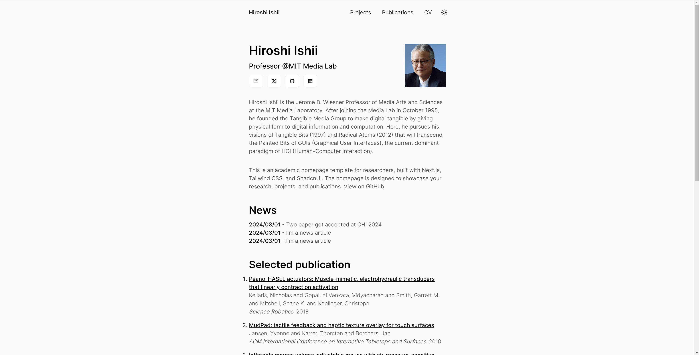

# Academic Homepage Template

This project is an academic homepage template built with Next.js, Tailwind CSS, and ShadcnUI. The design is minimalistic and modern, providing a clean and professional look for academic portfolios. It supports deployment to Zeabur and can directly parse `.bib` files to display publications.



## Features

- **Minimalistic Design**: Clean and modern interface to showcase academic work.
- **Markdown Support**: Write website content using markdown files.
- **Dark Mode**: Supports dark mode for a comfortable viewing experience.
- **Responsive Design**: Fully responsive and mobile-friendly.
- **Bib File Parsing**: Directly parse and display publications from `.bib` files.

## Customization

### Structure

Your data is divided into three parts:

- `public` folder: Stores your images and CV files.
- `data` folder: Stores your MDX files and `.bib` files.
- `website.config.js`: Contains your personal information and social media links.

### MDX

We use `.mdx` files to write content, which is an extension of markdown files. You can use markdown syntax to write your content.

### Project frontmatter

MDX files in the `data/projects` directory need to include frontmatter at the top in the following format:

```
---

title: "FibeRobo"

description: "Fabricating 4D Fiber Interfaces by Continuous Drawing of Temperature Tunable Liquid Crystal Elastomers"

date: "2023-01-01"

image: "/project1.jpg"

---
```

The image can be stored in the `public` folder.

## Bib Files

Place your .bib file in the `data/bib` directory. The application will automatically parse the file and display your publications. Make sure to name the `.bib` file as `Publications.bib` or `SelectedPublications.bib` for correct parsing.

And if your paper is awarded, you can add`award={Best Paper Award}` or `award={Hornorable Mention}`to your bibtex.

## Development

### Prerequisites

- Node.js (version 14.x or higher)
- pnpm

### Installation

1. **Clone the repository**

   ```bash
   git clone https://github.com/anxndsgn/academic-homepage-template.git
   cd academic-homepage-template
   ```

2. **Install dependencies**

   Using pnpm:

   ```bash
   pnpm i
   ```

### Development

To start the development server, run:

```bash
pnpm run dev
```

Open http://localhost:3000 in your browser to see the result.

## Deployment

- Sign in to Zeabur and create a new project.
- Fork this repo.
- Deploy the project using Git service.
  For more detailed instructions, refer to the [Zeabur documentation](https://zeabur.com/docs/deploy/github).

[](https://zeabur.com?referralCode=anxndsgn&utm_source=anxndsgn&utm_campaign=oss)

## Contributing

Contributions are welcome! Please open an issue or submit a pull request.

## License

This project is licensed under the MIT License. See the LICENSE file for details.

## Acknowledgements

- Next.js
- Tailwind CSS
- ShadcnUI
- Zeabur
